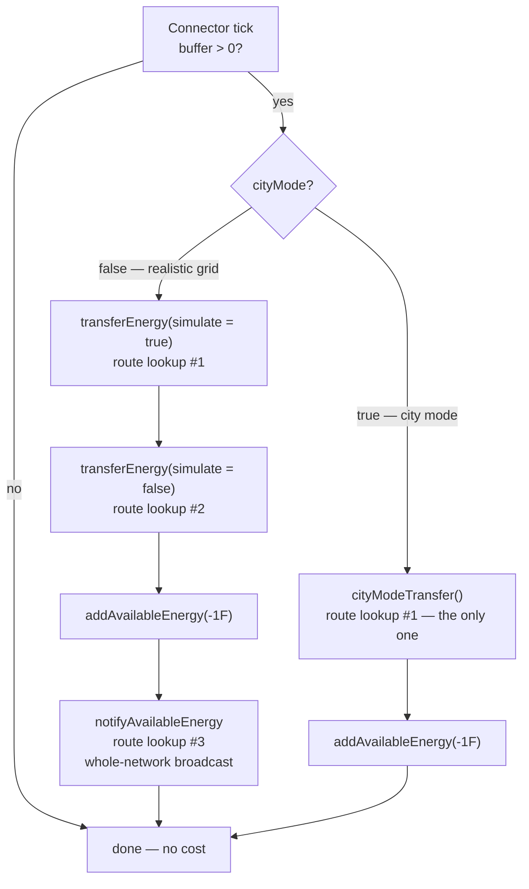

# City Mode

Technical documentation for the fork's config-gated "city mode" — a mod-wide simplification of
Immersive Engineering's simulation, covering wires, floodlights, generators and machines
(Forge 1.12.2).

## Overview

City mode trades Immersive Engineering's simulation detail for server tick time. It is aimed at
city/roleplay packs where the mod's machinery is set dressing rather than an engineering puzzle:
you keep the entire look of the build, and give up the physics behind it.

It covers four subsystems:

| Subsystem | What is simplified |
|---|---|
| **Wires** | One lossless push per connector instead of loss, distance weighting, proportional split, a double simulate/real pass and a network-wide broadcast. |
| **Floodlights** | Beams are re-traced only when the light switches or a neighbour changes, never on a timer, and the number of light blocks one lamp may place is capped. |
| **Generators** | Fuel becomes cosmetic — a presence check and a token sip instead of a per-tick burn rate and a per-tick tank drain. |
| **Machines** | Idle multiblocks stop re-scanning the recipe list every tick, and the scan interval widens. |

**It is off by default**, and off means byte-identical to stock.

```
Config → Immersive Engineering → general
    cityMode             (default: false)   ← master switch
    cityModeWires        (default: true)
    cityModeFloodlights  (default: true)
    cityModeGenerators   (default: true)
    cityModeMachines     (default: true)
```

`cityMode` is the master switch. The four sub-flags default to on, so enabling the master alone
turns on everything; a subsystem is simplified only when the master is on **and** that sub-flag
has not been turned off. Switching the master off is therefore always sufficient to restore stock
behaviour. All five are plain booleans read live, so they take effect on config reload without a
world restart, and none of them touch saved data in either direction.

Every call site resolves the pairing through `common/util/CityMode.java`
(`CityMode.wires()`, `.floodlights()`, `.generators()`, `.machines()`) rather than repeating the
conjunction.

### Why these four, in this order

Cost is `instance count × per-tick cost`, and that ordering is not intuitive.

A live profile of a heavily-modded server measured IE at **16.65% of active server CPU — the
single most expensive individual mod** — of which roughly **11.5 points** were the wire traversal
alone. Connectors number in the hundreds to thousands on a real build, which is exactly how they
came to dominate. That is why wires came first.

**Floodlights** are second because a city lights its streets. Each lamp re-traces 13 beams and
recalculates block lighting on a timer, and every light block it places is an individually ticking
tile entity with no cap on the count — so one lamp is really one block plus dozens of ticking
children. Instance count in a city rivals connectors.

**Machines** are third, and the win is narrower than it looks: the expensive case is an *idle*
machine holding input it cannot use, not a busy one.

**Generators are last and worth the least.** A diesel generator's entire tick is a handful of
lookups and inserts; a city runs maybe ten to thirty of them. Making every generator in the world
free would reclaim on the order of 0.05% of a tick. The generator changes here are about the
*gameplay* semantics — fuel as set dressing — not about reclaiming CPU.

---

## Wires

The wire subsystem is the original city mode and by far the largest saving.

### Code footprint

The wire changes are remarkably small — **four calls to `CityMode.wires()`**, all inside a single
class:

| Location | Purpose |
|---|---|
| `TileEntityConnectorLV.java:73-74` | Tick dispatch: `cityModeTransfer()` instead of the double `transferEnergy` pass. |
| `TileEntityConnectorLV.java:91` | Skips the `notifyAvailableEnergy` network broadcast in the tick path. |
| `TileEntityConnectorLV.java:321` | Skips the same broadcast in `receiveEnergy` (the input path). |
| `TileEntityConnectorLV.java:510` | Forces the loss rate to zero in `getEnergyForConnection`. |

Nothing else in the energy system is aware of `cityModeWires` — not the path-finder, not the route
cache, not the save format, and no generator, machine or capacitor. This subsystem changes *how
much energy moves between connectors and how the amount is computed*, and nothing else. (The other
three subsystems are equally self-contained, each in its own class, behind its own flag.)

Because `TileEntityConnectorMV extends TileEntityConnectorLV` and
`TileEntityConnectorHV extends TileEntityConnectorMV`, all three voltage tiers and all three
relays inherit the behaviour verbatim.

---

### The per-tick path, side by side

Both modes share the same entry guard in `TileEntityConnectorLV.update()`
(`TileEntityConnectorLV.java:62-96`): server side only, and the entire body is skipped when the
connector's buffer is empty. **An idle connector costs nothing in either mode.**



#### Normal mode — what the three passes actually do

`transferEnergy` (`TileEntityConnectorLV.java:409`) runs **twice per tick**, once to simulate and
once for real. Each invocation:

1. Fetches the reachable output set from `ImmersiveNetHandler.getIndirectEnergyConnections`.
2. **Pass A** — offers every output `min(powerLeft, con.cableType.getTransferRate())` as a
   *simulated* insert, to discover total demand.
3. Builds a `TreeMap` keyed by `AbstractConnection`, whose `compareTo` orders primarily by
   `getAverageLossRate()` — so electrically-nearest outputs are served first.
4. **Pass B** — walks that map in order, giving each output its *proportional* share of the
   tick's budget (`its demand / total demand`), clamped by the wire's transfer rate, then applies
   `getPreciseLossRate()` and delivers the attenuated remainder.
5. Walks every `subConnection` of every route accumulating per-segment loss, recording throughput
   into `transferPerTick` (the wire-burnout ledger) and firing `onEnergyPassthrough` for energy
   meters.

`notifyAvailableEnergy` (`:493`) is then a **third** full walk of the network, advertising this
connector's energy to every reachable node.

Note the loss model is counter-intuitive: `Connection.getBaseLoss` scales loss *up* when a wire is
lightly loaded, so a barely-used long wire is proportionally worse than a saturated one.

#### City mode — one pass

`cityModeTransfer()` (`TileEntityConnectorLV.java:365`) in full:

```java
Set<AbstractConnection> outputs = ImmersiveNetHandler.INSTANCE
        .getIndirectEnergyConnections(Utils.toCC(this), world, true);
if(outputs.isEmpty())
    return;
int available = Math.min(getMaxOutput(), energyStorage.getEnergyStored());
int powerLeft = available;
for(AbstractConnection con : outputs)
{
    if(powerLeft <= 0)
        break;
    if(!con.isEnergyOutput || con.cableType == null || con.cableType.getTransferRate() <= 0)
        continue;                                   // non-conductive wire — rope, cable, redstone
    IImmersiveConnectable end = ApiUtils.toIIC(con.end, world);
    if(end == null || !end.allowEnergyToPass(null)) // breaker switches still cut
        continue;
    int sent = end.outputEnergy(powerLeft, false, 0);
    powerLeft -= sent;
    if(sent > 0)
        /* fire onEnergyPassthrough(sent) on each distinct node along the route, for meters */;
}
int consumed = available - powerLeft;
if(consumed > 0)
{
    energyStorage.modifyEnergyStored(-consumed);
    markDirty();
}
```

Three properties worth stating plainly:

- **Energy is conserved.** Only what receivers actually accepted (`available - powerLeft`) is
  deducted. City mode is lossless, not free — it never creates energy.
- **Distribution is greedy and unordered.** Each device is offered *all* remaining power, not a
  share. The iteration order is the hash order of a `ConcurrentHashMap`-backed set, so when demand
  exceeds supply, which devices get served is arbitrary (though stable for a fixed set of
  connections). Normal mode's proportional fairness is gone.
- **The wire's transfer rate is used only as a yes/no conductivity test**, never as a throughput
  limit.

---

### Block-by-block behaviour

#### Power sources

**No generator is affected by the *wire* subsystem.** Every one of them produces energy, consumes
its resource, and pushes to adjacent blocks through `EnergyHelper.insertFlux` exactly as it always
has. Generators do not talk to the wire network at all — they push into an adjacent *connector*,
and only then does `cityModeWires` become relevant.

The one generator that city mode *does* touch is the diesel generator, and only via the separate
`cityModeGenerators` flag — see [Generators](#generators). The table's last column below is about
the wire subsystem; the fuel column notes where the generator flag changes things.

| Block | Ticks | Consumes | Output | Reaches wires via | Changed by the wire subsystem |
|---|---|---|---|---|---|
| **Diesel Generator** | yes (master only) | fuel — `1000/burnTime` mB per tick, or 1 mB per 20 ticks under `cityModeGenerators` | `dieselGen_output`, **4096 FE/t** | adjacent blocks above multiblock positions 15/16/17 | no |
| **Thermoelectric Generator** | yes | nothing — source blocks are never consumed | `sqrt(tempDiff)/2 × thermoelectric_output` per axis, recomputed every 1024 ticks | push to all 6 sides | no |
| **Dynamo** | **no** — event-driven | rotation from a wheel | `dynamo_output × rotation` (`dynamo_output = 3`) | push to all 6 sides | no |
| **Windmill / Water Wheel** | yes | weather / water flow | no FE — they drive the dynamo | n/a | no |
| **Capacitor LV/MV/HV** | yes | n/a — a buffer, not a source | 256 / 1024 / 4096 FE/t out; 100k / 1M / 4M FE stored | push to sides configured `OUTPUT` | no |
| **Creative Capacitor** | yes | nothing | `Integer.MAX_VALUE` every tick to every neighbour | push to all 6 sides | no |
| **Lightning Rod** | yes (master only) | weather + structure height | sets buffer to `lightning_output` = **16,000,000 FE** on a strike | push, 2 blocks out horizontally | no |

##### Does a diesel generator still need fuel in city mode?

**Yes.** This is worth spelling out because it is the most common misunderstanding of what city
mode does. Fuel becomes *cosmetic*; it does not become *optional*.

`TileEntityDieselGenerator.update()` gates on two independent conditions, and **city mode changes
neither of them**:

1. **There must be demand.** It simulate-inserts 4096 FE into each of its up-to-three receivers
   and counts how many accept anything at all. If `connected == 0` the generator goes inactive,
   the fan spins down, and **no fuel is burned**.
2. **There must be fuel**, and the fluid must be registered in `DieselHandler` with a burn time.
   The tank only ever accepts registered fuels, so this is a real test — you cannot run a city on
   water.

What `cityModeGenerators` changes is only the *rate* of the drain that follows: 1 mB every 20
ticks instead of `1000/burnTime` mB every tick. A full 24-bucket tank then lasts roughly six and a
half hours of runtime rather than minutes. See [Generators](#generators).

The back-pressure that makes the demand gate work is the connector's buffer. A connector's
`FluxStorage` holds exactly one tick of input (256/1024/4096 FE) and its `receiveEnergy` returns 0
when full. So with no consumers, connectors saturate, the generator's simulate-insert returns 0,
and it idles with its fuel intact — in **every** mode.

Separately, `cityModeWires` raises the *yield* per unit of fuel: the 4096 FE/t leaving the
generator arrives at the machines undiminished instead of being attenuated by every wire segment
on the way. More useful power per bucket of biodiesel, but not power from nothing.

One caveat inherited from stock IE, present in all modes: the demand check is coarse. It asks "did
anyone accept *anything*?", so a connector willing to take 1 FE keeps the generator running — and
consuming fuel at whichever rate applies — for that tick.

#### Transmission

| Block | Role | City mode effect |
|---|---|---|
| **Connector LV / MV / HV** | The only blocks that move energy across wires. Buffer = 1 tick of input. In/out rate **256 / 1024 / 4096 FE/t**. | Push path replaced. **Its own in/out rate caps still apply** — they are the main remaining throttle. |
| **Relay LV / MV / HV** | Routing waypoint only. `isRelay()` makes `receiveEnergy` return 0, so it never holds energy. | None — its buffer is always empty, so the tick body never runs in either mode. |
| **Transformer / HV Transformer** | Connection adapter between tiers. Not tickable, holds no energy, imposes no cap of its own. | **Tier throttling disappears.** See below. |
| **Breaker Switch** | `allowEnergyToPass()` returns its active flag. | **None — still cuts.** Honoured both in the path-finder and as an endpoint gate in `cityModeTransfer`. |
| **Energy Meter** | Passive accumulator via `onEnergyPassthrough`. | Works, but only because `cityModeTransfer` explicitly replays the hook along each route. See below. |

##### Transformers and voltage tiers

A transformer never loses or caps anything itself. Tier limiting is *emergent*: the path-finder
records the **weakest wire on the whole path** as an `AbstractConnection`'s `cableType`. In normal
mode that value becomes a hard per-path throughput cap and its loss ratio is applied.

City mode reads that same `cableType` only to check `getTransferRate() > 0`. So once a network is
wired, **the tier no longer throttles or attenuates anything** — HV → transformer → LV delivers at
the source connector's full rate with no loss.

The *connection* rules are unchanged: you still cannot attach LV wire to an HV connector, and a
transformer still requires exactly one higher-tier and one lower-tier coil. City mode is voltage
agnostic in throughput, not in construction.

##### Energy meters

Meters needed two fixes to work in city mode, both worth knowing about if you touch this code:

1. The original `cityModeTransfer` pushed straight from source to endpoint without walking
   `con.subConnections`, so `onEnergyPassthrough` never fired and **every meter read zero**. Fixed
   by replaying the hook on each distinct node along the route, deduplicated through a `HashSet`.
2. `IImmersiveConnectable` declares `onEnergyPassthrough` twice — an `int` overload that
   `TileEntityImmersiveConnectable` overrides as an empty no-op, and a `double` overload that
   `TileEntityEnergyMeter` actually implements. The fix in (1) passed an `int`, which Java bound
   statically to the *no-op*. Meters still read zero until the call site was cast to `double`.

Because city mode is lossless, the meter sees the **full** amount at every hop, whereas normal
mode reports the loss-attenuated figure that segment actually carried.

##### Wire types

| Wire | Transfer FE/t | Loss / 16 blocks | Max length | Tier | Conductive | Shocks |
|---|---|---|---|---|---|---|
| Copper | 2048 | 5% | 16 | LV | yes | yes |
| Electrum | 8192 | 2.5% | 16 | MV | yes | yes |
| Steel (HV) | 32768 | 2.5% | 32 | HV | yes | yes |
| Copper, insulated | 2048 | 5% | 16 | LV | yes | no |
| Electrum, insulated | 8192 | 2.5% | 16 | MV | yes | no |
| Structural rope | 0 | — | 32 | structure | **no** | no |
| Structural cable | 0 | — | 32 | structure | **no** | no |
| Redstone | 0 | — | 32 | redstone | **no** | no |

**Non-conductive wires stay non-conductive in city mode.** Three independent layers enforce it:
rope/cable/redstone report a different wire category and can never attach to an energy connector
in the first place; normal mode's `min(power, transferRate)` clamps them to zero; and
`cityModeTransfer` rejects them explicitly at `getTransferRate() <= 0`. Because an
`AbstractConnection` carries the *minimum* rate on its path, a route crossing even one
non-conductive segment is rejected whole, in both modes.

**In city mode the transfer-rate and loss columns above stop applying.** Max length still does —
it is enforced by the coil item when you place the wire, not during transfer.

#### Consumers

Machines never pull from the network. Delivery is always a push, along one fixed chain that is
**byte-identical whether or not `cityModeWires` is on**:

```
cityModeTransfer / transferEnergy
  → IImmersiveConnectable.outputEnergy      (the receiving connector)
  → EnergyHelper.insertFlux                 (IF ↔ FE bridge)
  → IFluxReceiver.receiveEnergy  /  IEnergyStorage.receiveEnergy
  → FluxStorage.receiveEnergy               (honours the machine's own limitReceive)
```

The wire subsystem changes only *who calls this and with what number*. (`cityModeMachines`, covered
separately below, changes how often a machine looks for a *recipe* — never how it receives power.)

Device-side caps survive city mode; network-side caps do not:

| Cap | Survives city mode |
|---|---|
| Delivering connector's `getMaxOutput()` (256/1024/4096 FE/t) | **yes** |
| Connector's `currentTickToMachine` per-tick accumulator | **yes** |
| Machine's own `FluxStorage.limitReceive` | **yes** |
| Wire `cableType.getTransferRate()` | no |
| Per-segment loss | no |
| Proportional distribution across competing devices | no |

A caveat: most IE multiblocks are built with the single-argument `FluxStorage(capacity)`
constructor, which sets `limitReceive = capacity`. Those machines have **no meaningful intake cap
of their own** and are limited entirely by the connector feeding them. In normal mode the wire
rate is a second ceiling; in city mode it is not.

Examples:

- **Garden Cloche** — 16,000 FE buffer, intake capped at `max(belljar_consumption × 2, 8)` =
  **16 FE/t** against an 8 FE/t draw. This cap applies in city mode too, and is the one thing
  stopping a city-mode HV connector from shoving 4096 FE/t at it.
- **Arc Furnace** — 64,000 FE buffer, no practical intake cap. Fed a flat 4096 FE/t through HV
  connectors in city mode, it will run its multi-tick acceleration path freely.
- **Crusher** — 32,000 FE buffer, same story.

**A machine bolted directly to a generator with no wires at all is completely unaffected by the
wire subsystem.** Generators call `insertFlux` on their neighbours directly, never touching the
connector, the net handler or the wire types. Note that such a setup is still subject to
`cityModeGenerators` (the generator's fuel drain) and `cityModeMachines` (the machine's recipe
scan interval) — those are independent of how the power arrives.

---

## Floodlights

Gated behind `cityModeFloodlights`. Implemented in `TileEntityFloodlight`.

A floodlight is usually the most expensive block in a city build, and until this change nothing
about it had been optimised at all.

**What a floodlight does every 512 ticks, in stock:** re-traces all **13 beams**, walking up to 32
blocks per ray and queueing a light block roughly every third block, then calls
`world.checkLightFor` to recalculate block lighting. Every light it places is a
`TileEntityFakeLight` — **an individually ticking tile entity** — and nothing caps how many there
are, so one unobstructed lamp can own well over a hundred. The queue is then drained at up to 32
`world.setBlockState` calls every 8 ticks, each of which triggers its own lighting recalculation,
chunk re-render and neighbour notification.

So a single street lamp is not one ticking block. It is one block plus dozens of ticking children,
plus a periodic burst of light propagation. Multiply by the number of lamps in a lit city.

**City mode makes two changes:**

1. **No periodic re-scan.** The 512-tick rebuild exists to notice the world changing around a beam
   — someone builds a wall through it, or mines one away. City mode assumes static surroundings and
   rebuilds only when the light actually switches or a neighbouring block changes (the latter
   already sets `shouldUpdate`, so deliberate edits next to the lamp are still picked up).
2. **A cap of 64 queued lights per floodlight.**

**What you give up:** a change *further out along a beam* — not adjacent to the lamp — is not
noticed until something else triggers a rebuild. In practice that means a wall built across a beam
leaves the lights beyond it floating until the lamp is toggled. Reaching the 64-light cap stops the
remaining rays before they ray-trace, which can leave a beam lit asymmetrically; only pathological
setups get there.

---

## Generators

Gated behind `cityModeGenerators`. Implemented in `TileEntityDieselGenerator`.

Be clear about the motivation: **this is a gameplay change, not a meaningful performance win.** See
"Why these four, in this order" above — generators are too few to matter. What it buys is the
semantics: fuel as set dressing.

**Stock:** derives a per-tick burn rate from the fluid (`1000/burnTime`) and drains the tank
**every tick**, which also dirties the tank every tick.

**City mode:** checks that fuel is present and drains **1 mB every 20 ticks**. A full 24-bucket
tank lasts roughly six and a half hours of runtime — cosmetic, but visible enough that tanks still
drain and refuelling is still part of running a generator. Output was already a flat config value
and is unchanged.

**The load gate is deliberately kept.** "Only run when something actually wants power" is a
*performance* feature, not a realism one — it is what makes an idle generator free. Removing it
would have made city mode **slower**, because generators would push energy at saturated connectors
every tick only for it to be discarded. An idle generator still burns nothing in either mode.

The tank only ever accepts fluids registered as valid fuel, so requiring 1 mB of it is a genuine
"is there fuel" test rather than an invitation to run a city on water.

Other generators are unchanged, because there is nothing worth changing: the thermoelectric
generator already recomputes only every 1024 ticks, the dynamo is event-driven and does not tick at
all, and the windmill and water wheel were already cached and throttled.

---

## Machines

Gated behind `cityModeMachines`. Implemented in `TileEntityMultiblockMetal` and used by the Arc
Furnace, Squeezer, Fermenter, Mixer and Refinery.

The existing recipe-scan throttle deliberately **exempted idle machines**: the condition was
"queue empty **or** the interval elapsed", so a machine with nothing queued re-scanned every single
tick to pick up new input immediately.

That exemption protects the wrong case. A busy machine topping up its queue was already cheap. The
expensive one is a machine sitting with input it *cannot use*, re-scanning the entire recipe list
forever — and for the Arc Furnace that list is inflated to hundreds of entries by the
auto-generated recycling recipes. A decorative machine in a city build does exactly this,
indefinitely.

**City mode** applies the throttle to idle machines too, and widens the interval from **8 ticks to
32**.

**What you give up:** a machine can take up to 1.6 seconds to notice newly inserted items. Recipe
outputs, processing rates and throughput once running are all untouched.

---

## What changes, in gameplay terms

| Behaviour | Normal | City mode |
|---|---|---|
| Wire loss | 2.5–5% per 16 blocks, worse when lightly loaded | none |
| Voltage tiers | throttle throughput to the weakest wire on the path | cosmetic only |
| Distribution when supply < demand | proportional to demand, nearest-first | greedy, arbitrary order, first served wins |
| **Wire burnout / overload** | wire is destroyed with flame particles above its rate | **cannot happen — see below** |
| Wire shock damage | sourced from the whole network's advertised energy | sourced from the local connector's own buffer |
| Breaker switches | cut the network | unchanged |
| Energy meters | read loss-attenuated throughput | read full throughput |
| Floodlight beams | re-traced every 512 ticks | re-traced only on switch / neighbour change |
| Floodlight light count | uncapped | capped at 64 per lamp |
| Generator fuel burn | per-tick rate derived from the fluid | 1 mB every 20 ticks, cosmetic |
| Generator load gate | only runs under load | **unchanged — deliberately kept** |
| Generator output | flat config value | unchanged |
| Idle machine recipe scan | every tick | every 32 ticks |
| Machine recipe outputs / speed | — | unchanged |
| Machine power requirements | — | unchanged |

### Wire burnout is disabled

This is the least obvious consequence and deserves to be called out.

Overload destruction works by `transferEnergy` recording per-connection throughput into
`ImmersiveNetHandler.transferPerTick`; a world-tick END handler then destroys any connection whose
recorded rate exceeded its cable's transfer rate. **`transferEnergy` is the only writer of that
ledger.** `cityModeTransfer` has no equivalent, so in city mode the map stays empty, the END loop
iterates nothing, and no wire can ever burn out.

Combined with the fact that city mode never clamps to the cable rate, this means **a copper wire
will happily carry a full HV connector's 4096 FE/t forever, with no consequence.** That is
intentional for a city pack — it is the mechanical expression of "wires are set dressing" — but it
is a real rules change, not just an optimisation.

Wires can still be removed by every other means: breaking a connector, cutting them, or building a
block through the catenary.

### Wire shock damage becomes local

Shock damage is computed from a per-tick `sources` list on each connectable. In normal mode
`notifyAvailableEnergy` fills that list with an entry per upstream connector; in city mode the
broadcast is skipped, so the list holds only the connector's own stored energy.

Consequences: damage is generally **lower** (bounded by one connector's one-tick buffer rather than
the summed network supply), and a wire span running between two *relays* mid-network **will no
longer shock at all**, because relays never hold energy. If you do not want wire damage in a city
pack, `enableWireDamage = false` turns it off properly.

---

## Performance

### Where the cost goes

Per powered connector per tick, with `N` reachable outputs and `S` wire segments per route:

| Work | Normal | City |
|---|---|---|
| Route-set lookups (cached) | **3** | **1** |
| `outputEnergy` calls | **~6N** (2 passes × 3 calls per output) | **N** |
| `TreeMap` sort by loss rate | N log N | none |
| Per-segment float loss math | 2 × N × S | none |
| Burnout ledger map writes | N × S | none |
| Whole-network broadcast | 1 full walk | none |

The reduction is structural rather than incremental: two of the three network walks disappear
entirely, and the surviving one does a sixth of the per-output work with no sorting and no
floating-point loss accumulation.

### Estimated tick usage

> **These are modelled figures, not measurements.** They are derived by applying the operation
> counts above to the one *measured* baseline this fork has — a live spark profile of the
> production server. City mode itself has not yet been profiled under live load. Treat the shape
> as sound and the exact percentages as an estimate.

Measured baseline (whole server, active CPU excluding idle):

| Metric | Value |
|---|---|
| Immersive Engineering, total | **16.65%** — the #1 individual mod |
| ├ wire energy traversal | ~11.5% |
| │  ├ `notifyAvailableEnergy` | 5.25% |
| │  ├ `transferEnergy` + `getIndirectEnergyConnections` | ~6.25% |
| │  └ of which `ApiUtils.toIIC` | 2.23% |
| └ everything else in IE | ~5.15% |

Applying the model: city mode removes the `notifyAvailableEnergy` broadcast outright (both the
tick path and, since this fork's input-path fix, the `receiveEnergy` path), and cuts the push work
by roughly the 6:1 operation ratio.

| Share of active CPU | Normal | City mode (modelled) |
|---|---|---|
| Wire traversal | ~11.5% | **~1.5%** |
| IE total | ~16.65% | **~6.65%** |

That is on the order of **10 percentage points of active server CPU** reclaimed on a grid-heavy
build — but only on a build where the grid is actually large. City mode does nothing for a base
whose cost is entities or chunk I/O, and the baseline profile showed larger non-IE costs elsewhere
(chunk NBT handling and vehicle physics both exceeded IE's share).

#### The other three subsystems

The figures above cover **wires only**, because that is the only part the baseline profile can
speak to — the floodlight, machine and generator work all lives inside the "everything else in IE"
5.15% slice, which was never broken down.

They are not modelled here, deliberately. Their value depends entirely on *what you built*, in a
way the wire figure does not:

- **Floodlights** scale with how many lamps you have and how obstructed their beams are. A build
  with no floodlights saves nothing; a lit city could plausibly save more than the wire change,
  since the recurring cost is ray-tracing plus light propagation plus a crowd of ticking light
  blocks. This is the one to measure first if you have street lighting.
- **Machines** scale with how many multiblocks sit idle holding unusable input. Zero if your
  machines are all either empty or busy.
- **Generators** are negligible and are not expected to move the needle at all — they are in for
  the gameplay semantics.

Anyone quoting a number for these should measure it. To do that on your own server, capture a
profile before and after per `docs/agent-plans/SPARK_MEASUREMENT_GUIDE.md`, and toggle the
sub-flags individually so each subsystem's contribution is separable.

---

## Testing checklist

With `cityMode = false` — regression check, must be indistinguishable from stock:

- [ ] Power behaves exactly as before: loss over long wires, tier throttling, proportional split.
- [ ] Overloading a copper wire still destroys it with flame particles.
- [ ] A floodlight still re-scans its beams periodically: build a wall through a lit beam and
      confirm the lights beyond it disappear within ~25 seconds without touching the lamp.
- [ ] A diesel generator drains fuel at the stock rate.
- [ ] A machine picks up hopper-fed input within a tick or two.

With `cityMode = true` — wires:

- [ ] A generator → connectors → machine chain still powers the machine.
- [ ] Capacitors charge; relays and transformers still pass power.
- [ ] A device at the far end of a long wire receives **full** power (no loss).
- [ ] Redstone, structural rope and steel cable still carry **no** power.
- [ ] A breaker switch still cuts its network.
- [ ] An energy meter reads non-zero throughput.
- [ ] Entities touching a powered wire still take shock damage — reduced, and absent on spans
      between two relays. If unwanted, set `enableWireDamage = false`.

With `cityMode = true` — floodlights:

- [ ] A floodlight still lights its beams normally when switched on, and goes dark when switched
      off or unpowered.
- [ ] Rotating a floodlight with the hammer still moves the beams.
- [ ] Placing a block directly beside the lamp still triggers a rebuild.
- [ ] Expected difference: a wall built across a beam **further out** leaves the lights beyond it
      until the lamp is toggled. Confirm that is acceptable.
- [ ] No orphaned light blocks are left behind after breaking a floodlight.

With `cityMode = true` — generators:

- [ ] A diesel generator with no consumers attached burns **no** fuel and its fan spins down.
- [ ] With consumers attached it runs, and the tank drains slowly but visibly.
- [ ] An empty tank still stops the generator.

With `cityMode = true` — machines:

- [ ] Arc Furnace, Squeezer, Fermenter, Mixer and Refinery all still craft, at unchanged speed.
- [ ] Hopper-fed input is picked up within ~1.6 s (the widened idle scan interval).
- [ ] A machine holding non-matching input does not stall a machine beside it.

Finally:

- [ ] Toggling `cityMode` off again restores stock behaviour with no save damage.
- [ ] Each sub-flag can be turned off individually while the master stays on.

Saves are unaffected in every direction: city mode adds no NBT and changes no persisted state.
