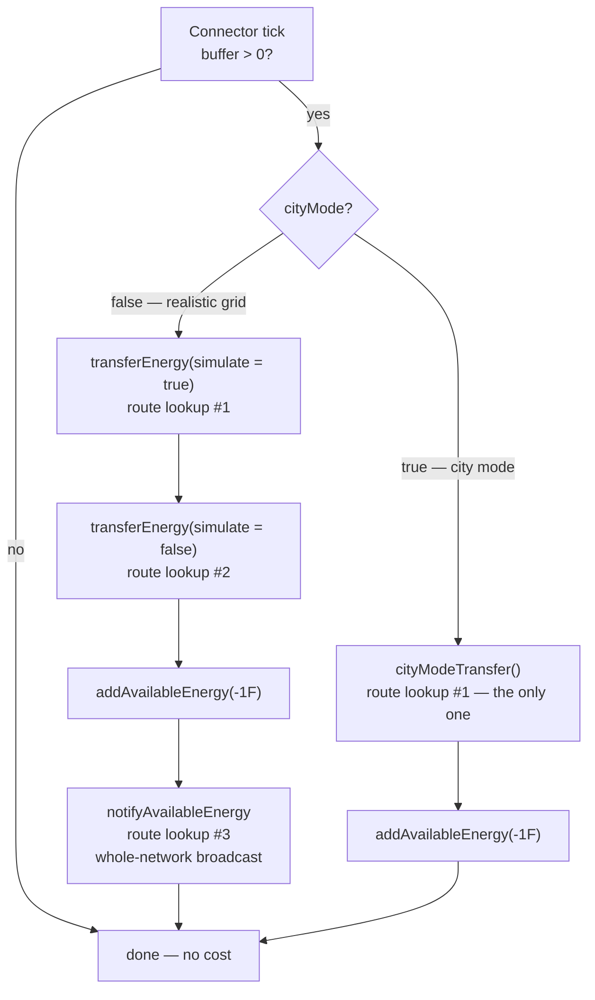

# City Mode

Technical documentation for the fork's config-gated "city mode" power simulation
(Forge 1.12.2).

## Overview

City mode is an opt-in setting that keeps every visible part of Immersive Engineering's
electrical system — connectors, relays, transformers, breaker switches, energy meters and the
catenary wires strung between them — while replacing the *simulation* behind them with a single
lossless push.

It exists for one reason: on a large build, the realistic grid is the most expensive thing
Immersive Engineering does per tick. A live profile of a heavily-modded server measured IE at
**16.65% of active server CPU — the single most expensive individual mod** — of which roughly
**11.5 percentage points** were the wire energy traversal alone. City mode targets exactly that
traversal and leaves the rest of the mod untouched.

The trade is deliberate: you give up wire loss, voltage-tier throughput limits, distance-weighted
distribution and wire burnout. You keep fuel costs, generator output rates, machine power
requirements, connector throughput caps, breaker switches, energy meters and the entire look of
the build. It is aimed at city/roleplay packs where the wiring is set dressing rather than an
engineering puzzle.

**It is off by default.** With `cityMode = false` the code paths below are not entered and
behaviour is byte-identical to stock Immersive Engineering.

```
Config → Immersive Engineering → general → cityMode   (default: false)
```

The flag is a plain `public static boolean` read live every tick
(`common/Config.java:78`), so it takes effect on config reload without a world restart.

---

## Code footprint

City mode is remarkably small. It is **four runtime reads of one boolean**, all inside a single
class:

| Location | Purpose |
|---|---|
| `common/Config.java:78` | The flag itself, plus its `@Comment` documentation. |
| `TileEntityConnectorLV.java:73-74` | Tick dispatch: `cityModeTransfer()` instead of the double `transferEnergy` pass. |
| `TileEntityConnectorLV.java:91` | Skips the `notifyAvailableEnergy` network broadcast in the tick path. |
| `TileEntityConnectorLV.java:321` | Skips the same broadcast in `receiveEnergy` (the input path). |
| `TileEntityConnectorLV.java:510` | Forces the loss rate to zero in `getEnergyForConnection`. |

Everything else — every generator, every machine, every capacitor, the path-finder, the cache,
the save format — is completely unaware of the flag. That is the design: city mode changes *how
much energy moves between connectors and how the amount is computed*, and nothing else.

Because `TileEntityConnectorMV extends TileEntityConnectorLV` and
`TileEntityConnectorHV extends TileEntityConnectorMV`, all three voltage tiers and all three
relays inherit the behaviour verbatim.

---

## The per-tick path, side by side

Both modes share the same entry guard in `TileEntityConnectorLV.update()`
(`TileEntityConnectorLV.java:62-96`): server side only, and the entire body is skipped when the
connector's buffer is empty. **An idle connector costs nothing in either mode.**



### Normal mode — what the three passes actually do

`transferEnergy` (`TileEntityConnectorLV.java:409`) runs **twice per tick**, once to simulate and
once for real. Each invocation:

1. Fetches the reachable output set from `ImmersiveNetHandler.getIndirectEnergyConnections`.
2. **Pass A** — offers every output `min(powerLeft, con.cableType.getTransferRate())` as a
   *simulated* insert, to discover total demand.
3. Builds a `TreeMap` keyed by `AbstractConnection`, whose `compareTo` orders primarily by
   `getAverageLossRate()` — so electrically-nearest outputs are served first.
4. **Pass B** — walks that map in order, giving each output its *proportional* share of the
   tick's budget (`its demand / total demand`), clamped by the wire's transfer rate, then applies
   `getPreciseLossRate()` and delivers the attenuated remainder.
5. Walks every `subConnection` of every route accumulating per-segment loss, recording throughput
   into `transferPerTick` (the wire-burnout ledger) and firing `onEnergyPassthrough` for energy
   meters.

`notifyAvailableEnergy` (`:493`) is then a **third** full walk of the network, advertising this
connector's energy to every reachable node.

Note the loss model is counter-intuitive: `Connection.getBaseLoss` scales loss *up* when a wire is
lightly loaded, so a barely-used long wire is proportionally worse than a saturated one.

### City mode — one pass

`cityModeTransfer()` (`TileEntityConnectorLV.java:365`) in full:

```java
Set<AbstractConnection> outputs = ImmersiveNetHandler.INSTANCE
        .getIndirectEnergyConnections(Utils.toCC(this), world, true);
if(outputs.isEmpty())
    return;
int available = Math.min(getMaxOutput(), energyStorage.getEnergyStored());
int powerLeft = available;
for(AbstractConnection con : outputs)
{
    if(powerLeft <= 0)
        break;
    if(!con.isEnergyOutput || con.cableType == null || con.cableType.getTransferRate() <= 0)
        continue;                                   // non-conductive wire — rope, cable, redstone
    IImmersiveConnectable end = ApiUtils.toIIC(con.end, world);
    if(end == null || !end.allowEnergyToPass(null)) // breaker switches still cut
        continue;
    int sent = end.outputEnergy(powerLeft, false, 0);
    powerLeft -= sent;
    if(sent > 0)
        /* fire onEnergyPassthrough(sent) on each distinct node along the route, for meters */;
}
int consumed = available - powerLeft;
if(consumed > 0)
{
    energyStorage.modifyEnergyStored(-consumed);
    markDirty();
}
```

Three properties worth stating plainly:

- **Energy is conserved.** Only what receivers actually accepted (`available - powerLeft`) is
  deducted. City mode is lossless, not free — it never creates energy.
- **Distribution is greedy and unordered.** Each device is offered *all* remaining power, not a
  share. The iteration order is the hash order of a `ConcurrentHashMap`-backed set, so when demand
  exceeds supply, which devices get served is arbitrary (though stable for a fixed set of
  connections). Normal mode's proportional fairness is gone.
- **The wire's transfer rate is used only as a yes/no conductivity test**, never as a throughput
  limit.

---

## Block-by-block behaviour

### Power sources

**No generator reads the city-mode flag.** Every one of them produces energy, consumes its
resource, and pushes to adjacent blocks through `EnergyHelper.insertFlux` exactly as it always
has. Generators do not talk to the wire network at all — they push into an adjacent *connector*,
and only then does city mode become relevant.

| Block | Ticks | Consumes | Output | Reaches wires via | Changed by city mode |
|---|---|---|---|---|---|
| **Diesel Generator** | yes (master only) | fuel, `1000/burnTime` mB per tick | `dieselGen_output`, **4096 FE/t** | adjacent blocks above multiblock positions 15/16/17 | no |
| **Thermoelectric Generator** | yes | nothing — source blocks are never consumed | `sqrt(tempDiff)/2 × thermoelectric_output` per axis, recomputed every 1024 ticks | push to all 6 sides | no |
| **Dynamo** | **no** — event-driven | rotation from a wheel | `dynamo_output × rotation` (`dynamo_output = 3`) | push to all 6 sides | no |
| **Windmill / Water Wheel** | yes | weather / water flow | no FE — they drive the dynamo | n/a | no |
| **Capacitor LV/MV/HV** | yes | n/a — a buffer, not a source | 256 / 1024 / 4096 FE/t out; 100k / 1M / 4M FE stored | push to sides configured `OUTPUT` | no |
| **Creative Capacitor** | yes | nothing | `Integer.MAX_VALUE` every tick to every neighbour | push to all 6 sides | no |
| **Lightning Rod** | yes (master only) | weather + structure height | sets buffer to `lightning_output` = **16,000,000 FE** on a strike | push, 2 blocks out horizontally | no |

#### Does a diesel generator still need fuel in city mode?

**Yes.** This is worth spelling out because it is the most common misunderstanding of what city
mode does.

`TileEntityDieselGenerator.update()` gates fuel consumption on two independent conditions, neither
of which city mode touches:

1. **There must be demand.** It simulate-inserts 4096 FE into each of its up-to-three receivers
   and counts how many accept anything at all. If `connected == 0` the generator goes inactive,
   the fan spins down, and **no fuel is burned**.
2. **There must be fuel**, and the fluid must be registered in `DieselHandler` with a burn time.

Only then does it drain `1000/burnTime` mB and push out its 4096 FE/t.

The back-pressure that makes this work is the connector's buffer. A connector's `FluxStorage`
holds exactly one tick of input (256/1024/4096 FE) and its `receiveEnergy` returns 0 when full. So
with no consumers, connectors saturate, the generator's simulate-insert returns 0, and it idles
with its fuel intact — in **both** modes.

What city mode does change is the *yield* per unit of fuel: the 4096 FE/t leaving the generator
arrives at the machines undiminished instead of being attenuated by every wire segment on the way.
More useful power per bucket of biodiesel, but not power from nothing.

One caveat inherited from stock IE, present in both modes: the demand check is coarse. It asks
"did anyone accept *anything*?", so a connector willing to take 1 FE keeps the generator burning
fuel at the full per-tick rate for that tick.

### Transmission

| Block | Role | City mode effect |
|---|---|---|
| **Connector LV / MV / HV** | The only blocks that move energy across wires. Buffer = 1 tick of input. In/out rate **256 / 1024 / 4096 FE/t**. | Push path replaced. **Its own in/out rate caps still apply** — they are the main remaining throttle. |
| **Relay LV / MV / HV** | Routing waypoint only. `isRelay()` makes `receiveEnergy` return 0, so it never holds energy. | None — its buffer is always empty, so the tick body never runs in either mode. |
| **Transformer / HV Transformer** | Connection adapter between tiers. Not tickable, holds no energy, imposes no cap of its own. | **Tier throttling disappears.** See below. |
| **Breaker Switch** | `allowEnergyToPass()` returns its active flag. | **None — still cuts.** Honoured both in the path-finder and as an endpoint gate in `cityModeTransfer`. |
| **Energy Meter** | Passive accumulator via `onEnergyPassthrough`. | Works, but only because `cityModeTransfer` explicitly replays the hook along each route. See below. |

#### Transformers and voltage tiers

A transformer never loses or caps anything itself. Tier limiting is *emergent*: the path-finder
records the **weakest wire on the whole path** as an `AbstractConnection`'s `cableType`. In normal
mode that value becomes a hard per-path throughput cap and its loss ratio is applied.

City mode reads that same `cableType` only to check `getTransferRate() > 0`. So once a network is
wired, **the tier no longer throttles or attenuates anything** — HV → transformer → LV delivers at
the source connector's full rate with no loss.

The *connection* rules are unchanged: you still cannot attach LV wire to an HV connector, and a
transformer still requires exactly one higher-tier and one lower-tier coil. City mode is voltage
agnostic in throughput, not in construction.

#### Energy meters

Meters needed two fixes to work in city mode, both worth knowing about if you touch this code:

1. The original `cityModeTransfer` pushed straight from source to endpoint without walking
   `con.subConnections`, so `onEnergyPassthrough` never fired and **every meter read zero**. Fixed
   by replaying the hook on each distinct node along the route, deduplicated through a `HashSet`.
2. `IImmersiveConnectable` declares `onEnergyPassthrough` twice — an `int` overload that
   `TileEntityImmersiveConnectable` overrides as an empty no-op, and a `double` overload that
   `TileEntityEnergyMeter` actually implements. The fix in (1) passed an `int`, which Java bound
   statically to the *no-op*. Meters still read zero until the call site was cast to `double`.

Because city mode is lossless, the meter sees the **full** amount at every hop, whereas normal
mode reports the loss-attenuated figure that segment actually carried.

#### Wire types

| Wire | Transfer FE/t | Loss / 16 blocks | Max length | Tier | Conductive | Shocks |
|---|---|---|---|---|---|---|
| Copper | 2048 | 5% | 16 | LV | yes | yes |
| Electrum | 8192 | 2.5% | 16 | MV | yes | yes |
| Steel (HV) | 32768 | 2.5% | 32 | HV | yes | yes |
| Copper, insulated | 2048 | 5% | 16 | LV | yes | no |
| Electrum, insulated | 8192 | 2.5% | 16 | MV | yes | no |
| Structural rope | 0 | — | 32 | structure | **no** | no |
| Structural cable | 0 | — | 32 | structure | **no** | no |
| Redstone | 0 | — | 32 | redstone | **no** | no |

**Non-conductive wires stay non-conductive in city mode.** Three independent layers enforce it:
rope/cable/redstone report a different wire category and can never attach to an energy connector
in the first place; normal mode's `min(power, transferRate)` clamps them to zero; and
`cityModeTransfer` rejects them explicitly at `getTransferRate() <= 0`. Because an
`AbstractConnection` carries the *minimum* rate on its path, a route crossing even one
non-conductive segment is rejected whole, in both modes.

**In city mode the transfer-rate and loss columns above stop applying.** Max length still does —
it is enforced by the coil item when you place the wire, not during transfer.

### Consumers

Machines never pull from the network. Delivery is always a push, along one fixed chain that is
**byte-identical in both modes**:

```
cityModeTransfer / transferEnergy
  → IImmersiveConnectable.outputEnergy      (the receiving connector)
  → EnergyHelper.insertFlux                 (IF ↔ FE bridge)
  → IFluxReceiver.receiveEnergy  /  IEnergyStorage.receiveEnergy
  → FluxStorage.receiveEnergy               (honours the machine's own limitReceive)
```

City mode changes only *who calls this and with what number*.

Device-side caps survive city mode; network-side caps do not:

| Cap | Survives city mode |
|---|---|
| Delivering connector's `getMaxOutput()` (256/1024/4096 FE/t) | **yes** |
| Connector's `currentTickToMachine` per-tick accumulator | **yes** |
| Machine's own `FluxStorage.limitReceive` | **yes** |
| Wire `cableType.getTransferRate()` | no |
| Per-segment loss | no |
| Proportional distribution across competing devices | no |

A caveat: most IE multiblocks are built with the single-argument `FluxStorage(capacity)`
constructor, which sets `limitReceive = capacity`. Those machines have **no meaningful intake cap
of their own** and are limited entirely by the connector feeding them. In normal mode the wire
rate is a second ceiling; in city mode it is not.

Examples:

- **Garden Cloche** — 16,000 FE buffer, intake capped at `max(belljar_consumption × 2, 8)` =
  **16 FE/t** against an 8 FE/t draw. This cap applies in city mode too, and is the one thing
  stopping a city-mode HV connector from shoving 4096 FE/t at it.
- **Arc Furnace** — 64,000 FE buffer, no practical intake cap. Fed a flat 4096 FE/t through HV
  connectors in city mode, it will run its multi-tick acceleration path freely.
- **Crusher** — 32,000 FE buffer, same story.

**A machine bolted directly to a generator with no wires at all is completely unaffected by city
mode.** Generators call `insertFlux` on their neighbours directly, never touching the connector,
the net handler or the wire types.

---

## What changes, in gameplay terms

| Behaviour | Normal | City mode |
|---|---|---|
| Wire loss | 2.5–5% per 16 blocks, worse when lightly loaded | none |
| Voltage tiers | throttle throughput to the weakest wire on the path | cosmetic only |
| Distribution when supply < demand | proportional to demand, nearest-first | greedy, arbitrary order, first served wins |
| **Wire burnout / overload** | wire is destroyed with flame particles above its rate | **cannot happen — see below** |
| Wire shock damage | sourced from the whole network's advertised energy | sourced from the local connector's own buffer |
| Breaker switches | cut the network | unchanged |
| Energy meters | read loss-attenuated throughput | read full throughput |
| Generator fuel | consumed only under load | unchanged |
| Machine power requirements | unchanged | unchanged |

### Wire burnout is disabled

This is the least obvious consequence and deserves to be called out.

Overload destruction works by `transferEnergy` recording per-connection throughput into
`ImmersiveNetHandler.transferPerTick`; a world-tick END handler then destroys any connection whose
recorded rate exceeded its cable's transfer rate. **`transferEnergy` is the only writer of that
ledger.** `cityModeTransfer` has no equivalent, so in city mode the map stays empty, the END loop
iterates nothing, and no wire can ever burn out.

Combined with the fact that city mode never clamps to the cable rate, this means **a copper wire
will happily carry a full HV connector's 4096 FE/t forever, with no consequence.** That is
intentional for a city pack — it is the mechanical expression of "wires are set dressing" — but it
is a real rules change, not just an optimisation.

Wires can still be removed by every other means: breaking a connector, cutting them, or building a
block through the catenary.

### Wire shock damage becomes local

Shock damage is computed from a per-tick `sources` list on each connectable. In normal mode
`notifyAvailableEnergy` fills that list with an entry per upstream connector; in city mode the
broadcast is skipped, so the list holds only the connector's own stored energy.

Consequences: damage is generally **lower** (bounded by one connector's one-tick buffer rather than
the summed network supply), and a wire span running between two *relays* mid-network **will no
longer shock at all**, because relays never hold energy. If you do not want wire damage in a city
pack, `enableWireDamage = false` turns it off properly.

---

## Performance

### Where the cost goes

Per powered connector per tick, with `N` reachable outputs and `S` wire segments per route:

| Work | Normal | City |
|---|---|---|
| Route-set lookups (cached) | **3** | **1** |
| `outputEnergy` calls | **~6N** (2 passes × 3 calls per output) | **N** |
| `TreeMap` sort by loss rate | N log N | none |
| Per-segment float loss math | 2 × N × S | none |
| Burnout ledger map writes | N × S | none |
| Whole-network broadcast | 1 full walk | none |

The reduction is structural rather than incremental: two of the three network walks disappear
entirely, and the surviving one does a sixth of the per-output work with no sorting and no
floating-point loss accumulation.

### Estimated tick usage

> **These are modelled figures, not measurements.** They are derived by applying the operation
> counts above to the one *measured* baseline this fork has — a live spark profile of the
> production server. City mode itself has not yet been profiled under live load. Treat the shape
> as sound and the exact percentages as an estimate.

Measured baseline (whole server, active CPU excluding idle):

| Metric | Value |
|---|---|
| Immersive Engineering, total | **16.65%** — the #1 individual mod |
| ├ wire energy traversal | ~11.5% |
| │  ├ `notifyAvailableEnergy` | 5.25% |
| │  ├ `transferEnergy` + `getIndirectEnergyConnections` | ~6.25% |
| │  └ of which `ApiUtils.toIIC` | 2.23% |
| └ everything else in IE | ~5.15% |

Applying the model: city mode removes the `notifyAvailableEnergy` broadcast outright (both the
tick path and, since this fork's input-path fix, the `receiveEnergy` path), and cuts the push work
by roughly the 6:1 operation ratio.

| Share of active CPU | Normal | City mode (modelled) |
|---|---|---|
| Wire traversal | ~11.5% | **~1.5%** |
| IE total | ~16.65% | **~6.65%** |

That is on the order of **10 percentage points of active server CPU** reclaimed on a grid-heavy
build — but only on a build where the grid is actually large. City mode does nothing for a base
whose cost is machines, entities or chunk I/O, and the baseline profile showed larger non-IE costs
elsewhere (chunk NBT handling and vehicle physics both exceeded IE's share).

To validate on your own server, capture a profile before and after per
`docs/agent-plans/SPARK_MEASUREMENT_GUIDE.md`.

---

## Testing checklist

With `cityMode = false` — regression check, must be indistinguishable from stock:

- [ ] Power behaves exactly as before: loss over long wires, tier throttling, proportional split.
- [ ] Overloading a copper wire still destroys it with flame particles.

With `cityMode = true`:

- [ ] A generator → connectors → machine chain still powers the machine.
- [ ] Capacitors charge; relays and transformers still pass power.
- [ ] A device at the far end of a long wire receives **full** power (no loss).
- [ ] Redstone, structural rope and steel cable still carry **no** power.
- [ ] A breaker switch still cuts its network.
- [ ] An energy meter reads non-zero throughput.
- [ ] A diesel generator with no consumers attached burns **no** fuel.
- [ ] Entities touching a powered wire still take shock damage — reduced, and absent on spans
      between two relays. If unwanted, set `enableWireDamage = false`.
- [ ] Toggling the config off again restores stock behaviour with no save damage.

Saves are unaffected in both directions: city mode adds no NBT and changes no persisted state.
