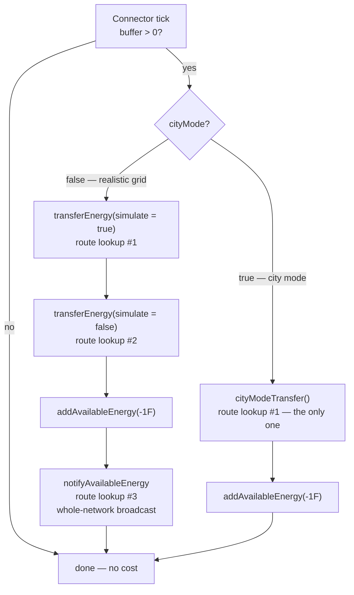

# Performance Tuning and City Mode

How to make Immersive Engineering cheap on the server tick, and what each option costs you
(Forge 1.12.2).

Two things live here: **recommended configurations**, backed by measurements from this fork, and a
**reference for city mode**, the config-gated simplification of the mod's simulation.

## The headline

If you read nothing else:

> **You do not need to configure anything.** The expensive part of the wire network has been
> removed in code. On a profiled world, roughly **half** of everything Immersive Engineering did
> was a single per-tick broadcast that existed only to feed wire-shock damage — running whether or
> not anything was near a wire, and running even when wire damage was switched off. That figure is
> now computed on demand, when an entity actually touches a wire. Nothing about gameplay changes,
> and no setting is involved.

Getting there took a wrong turn worth recording. The first fix was to skip the broadcast when
`enableWireDamage=false`, which measured a ~60% cut — better than city mode, which was the feature
built specifically to make the wire network cheap. That made it obvious the cost was never the
physics at all, and the right move was to stop broadcasting entirely rather than to make people
choose. See [Measured results](#measured-results) for the numbers that forced that conclusion.

**What this means for the options below:** `enableWireDamage` is now a pure gameplay switch with
no meaningful performance effect, and city mode's performance case is largely gone — what remains
of it is worth about 1.6% of active CPU. City mode is still a coherent *gameplay* feature. It is
no longer a performance recommendation.

---

## Recommended configurations

The short version: **run the defaults.** The wire network's cost was fixed in code, not in config.
The rows below are about gameplay, plus a couple of settings worth deliberately leaving alone.

### Recommended — the defaults

```
enableWireDamage = true
cityMode         = false
```

Everything on, full realistic grid, wire damage working. Since the damage figures are now computed
on demand, leaving that feature enabled costs essentially nothing: the work happens when an entity
touches a live wire, which is rare, instead of on every connector every tick.

### If you don't want wire shock damage

```
enableWireDamage = false
```

A gameplay choice now, not a performance one. It used to be the single biggest performance setting
in the mod; that is no longer true, because the cost it was avoiding no longer exists for anyone.

### City / roleplay pack

```
cityMode = true          (plus the four cityMode* sub-flags, all default true)
```

Choose this for what it does to *gameplay*, not for speed. Wires become lossless and
voltage-agnostic, power distribution becomes greedy rather than proportional, and **wires can no
longer burn out**. Floodlights, generators and machines are simplified too — see the subsystem
sections below.

The remaining performance difference is small and measured: the full realistic distribution costs
1212 ms per 120-second capture against city mode's stripped-down push at 996 ms. That 216 ms is
about **1.6% of active CPU** — the entire price of every power mechanic city mode removes.

### Leave these alone

```
validateConnections = false     (already the default)
pump_placeCobble    = true      (already the default)
```

The first loads and checks every connection endpoint at world load and slows startup; turn it on
only when you suspect corrupted connection data, with a backup. The second makes the fluid pump
replace what it drains with cobblestone, which stops flowing-fluid updates propagating — a real
tick saving that is already on.

### Client FPS, not server tick

```
increasedRenderboxes        = false
disableFancyTESR            = true
disableFancyBlueprints      = true    (already the default)
increasedTileRenderdistance = 1.0
```

These do nothing for TPS. They are for low-end GPUs — see the client section below.

---

## Overview of city mode

City mode trades Immersive Engineering's simulation detail for server tick time. It is aimed at
city/roleplay packs where the mod's machinery is set dressing rather than an engineering puzzle:
you keep the entire look of the build, and give up the physics behind it.

It covers seven subsystems:

| Subsystem | What is simplified |
|---|---|
| **Wires** | One lossless push per connector instead of loss, distance weighting, proportional split, a double simulate/real pass and a network-wide broadcast. |
| **Floodlights** | Beams are re-traced only when the light switches or a neighbour changes, never on a timer, and the number of light blocks one lamp may place is capped. |
| **Generators** | Fuel becomes cosmetic — a presence check and a token sip instead of a per-tick burn rate and a per-tick tank drain. |
| **Machines** | Multiblocks with nothing to do stop re-scanning the recipe list every tick, and the scan interval widens. A switched-on machine also animates steadily rather than per-batch, and its energy buffer follows its redstone switch. |
| **Virtual grid** | Segments stop accounting for flux and switch to presence: a segment is energized or it is not, and its Service Units deliver freely. See [Virtual Power Grid](#virtual-power-grid). |
| **Fluid pipes** | A pipe hands its fluid to the endpoints on its network in order until it runs out, instead of simulating a fill against every one of them and then splitting the result in proportion. See [Fluid Pipes](#fluid-pipes). |
| **Conduits** | Bundles stop moving units of flux and switch to presence, exactly as the grid does: a conductor is energised or it is not. See [Conduits](#conduits). |

**It is off by default**, and off means byte-identical to stock.

```
Config → Immersive Engineering → general
    cityMode             (default: false)   ← master switch
    cityModeWires        (default: true)
    cityModeFloodlights  (default: true)
    cityModeGenerators   (default: true)
    cityModeMachines     (default: true)
    cityModeVirtualGrid  (default: true)
```

`cityMode` is the master switch. The five sub-flags default to on, so enabling the master alone
turns on everything; a subsystem is simplified only when the master is on **and** that sub-flag
has not been turned off. Switching the master off is therefore always sufficient to restore stock
behaviour. All six are plain booleans read live, so they take effect on config reload without a
world restart, and none of them touch saved data in either direction.

Every call site resolves the pairing through `common/util/CityMode.java`
(`CityMode.wires()`, `.floodlights()`, `.generators()`, `.machines()`, `.grid()`) rather than
repeating the conjunction.

### Why these four, in this order

Cost is `instance count × per-tick cost`, and that ordering is not intuitive.

A live profile of a heavily-modded server measured IE at **16.65% of active server CPU — the
single most expensive individual mod** — of which roughly **11.5 points** were the wire traversal
alone. Connectors number in the hundreds to thousands on a real build, which is exactly how they
came to dominate. That is why wires came first.

**Floodlights** are second because a city lights its streets. Each lamp re-traces 13 beams and
recalculates block lighting on a timer, and every light block it places is an individually ticking
tile entity with no cap on the count — so one lamp is really one block plus dozens of ticking
children. Instance count in a city rivals connectors.

**Machines** are third, and the win is narrower than it looks: the expensive case is an *idle*
machine holding input it cannot use, not a busy one.

**Generators are last and worth the least.** A diesel generator's entire tick is a handful of
lookups and inserts; a city runs maybe ten to thirty of them. Making every generator in the world
free would reclaim on the order of 0.05% of a tick. The generator changes here are about the
*gameplay* semantics — fuel as set dressing — not about reclaiming CPU.

---

## Wires

The wire subsystem is the original city mode and by far the largest saving.

### Code footprint

The wire changes are now down to **two calls to `CityMode.wires()`**, both inside
`TileEntityConnectorLV`:

| Site | Purpose |
|---|---|
| `update()` | Tick dispatch: `cityModeTransfer()` instead of the double `transferEnergy` pass. |
| `getEnergyForConnection()` | Forces the loss rate to zero. |

There used to be two more, both skipping the `notifyAvailableEnergy` broadcast — one in `update()`
and one in `receiveEnergy()`. They are gone because the broadcast itself is gone; nobody needs to
opt out of work that is no longer done.

Nothing else in the energy system is aware of `cityModeWires` — not the path-finder, not the route
cache, not the save format, and no generator, machine or capacitor. This subsystem changes *how
much energy moves between connectors and how the amount is computed*, and nothing else. (The other
three subsystems are equally self-contained, each in its own class, behind its own flag.)

Because `TileEntityConnectorMV extends TileEntityConnectorLV` and
`TileEntityConnectorHV extends TileEntityConnectorMV`, all three voltage tiers and all three
relays inherit the behaviour verbatim.

---

### The per-tick path, side by side

Both modes share the same entry guard in `TileEntityConnectorLV.update()`
(`TileEntityConnectorLV.java:62-96`): server side only, and the entire body is skipped when the
connector's buffer is empty. **An idle connector costs nothing in either mode.**



#### Normal mode — what the three passes actually do

`transferEnergy` (`TileEntityConnectorLV.java:409`) runs **twice per tick**, once to simulate and
once for real. Each invocation:

1. Fetches the reachable output set from `ImmersiveNetHandler.getIndirectEnergyConnections`.
2. **Pass A** — offers every output `min(powerLeft, con.cableType.getTransferRate())` as a
   *simulated* insert, to discover total demand.
3. Builds a `TreeMap` keyed by `AbstractConnection`, whose `compareTo` orders primarily by
   `getAverageLossRate()` — so electrically-nearest outputs are served first.
4. **Pass B** — walks that map in order, giving each output its *proportional* share of the
   tick's budget (`its demand / total demand`), clamped by the wire's transfer rate, then applies
   `getPreciseLossRate()` and delivers the attenuated remainder.
5. Walks every `subConnection` of every route accumulating per-segment loss, recording throughput
   into `transferPerTick` (the wire-burnout ledger) and firing `onEnergyPassthrough` for energy
   meters.

`notifyAvailableEnergy` (`:493`) is then a **third** full walk of the network, advertising this
connector's energy to every reachable node.

Note the loss model is counter-intuitive: `Connection.getBaseLoss` scales loss *up* when a wire is
lightly loaded, so a barely-used long wire is proportionally worse than a saturated one.

#### City mode — one pass

`cityModeTransfer()` (`TileEntityConnectorLV.java:365`) in full:

```java
Set<AbstractConnection> outputs = ImmersiveNetHandler.INSTANCE
        .getIndirectEnergyConnections(Utils.toCC(this), world, true);
if(outputs.isEmpty())
    return;
int available = Math.min(getMaxOutput(), energyStorage.getEnergyStored());
int powerLeft = available;
for(AbstractConnection con : outputs)
{
    if(powerLeft <= 0)
        break;
    if(!con.isEnergyOutput || con.cableType == null || con.cableType.getTransferRate() <= 0)
        continue;                                   // non-conductive wire — rope, cable, redstone
    IImmersiveConnectable end = ApiUtils.toIIC(con.end, world);
    if(end == null || !end.allowEnergyToPass(null)) // breaker switches still cut
        continue;
    int sent = end.outputEnergy(powerLeft, false, 0);
    powerLeft -= sent;
    if(sent > 0)
        /* fire onEnergyPassthrough(sent) on each distinct node along the route, for meters */;
}
int consumed = available - powerLeft;
if(consumed > 0)
{
    energyStorage.modifyEnergyStored(-consumed);
    markDirty();
}
```

Three properties worth stating plainly:

- **Energy is conserved.** Only what receivers actually accepted (`available - powerLeft`) is
  deducted. City mode is lossless, not free — it never creates energy.
- **Distribution is greedy and unordered.** Each device is offered *all* remaining power, not a
  share. The iteration order is the hash order of a `ConcurrentHashMap`-backed set, so when demand
  exceeds supply, which devices get served is arbitrary (though stable for a fixed set of
  connections). Normal mode's proportional fairness is gone.
- **The wire's transfer rate is used only as a yes/no conductivity test**, never as a throughput
  limit.

---

### Block-by-block behaviour

#### Power sources

**No generator is affected by the *wire* subsystem.** Every one of them produces energy, consumes
its resource, and pushes to adjacent blocks through `EnergyHelper.insertFlux` exactly as it always
has. Generators do not talk to the wire network at all — they push into an adjacent *connector*,
and only then does `cityModeWires` become relevant.

The one generator that city mode *does* touch is the diesel generator, and only via the separate
`cityModeGenerators` flag — see [Generators](#generators). The table's last column below is about
the wire subsystem; the fuel column notes where the generator flag changes things.

| Block | Ticks | Consumes | Output | Reaches wires via | Changed by the wire subsystem |
|---|---|---|---|---|---|
| **Diesel Generator** | yes (master only) | fuel — `1000/burnTime` mB per tick, or 1 mB per 20 ticks under `cityModeGenerators` | `dieselGen_output`, **4096 FE/t** | adjacent blocks above multiblock positions 15/16/17 | no |
| **Thermoelectric Generator** | yes | nothing — source blocks are never consumed | `sqrt(tempDiff)/2 × thermoelectric_output` per axis, recomputed every 1024 ticks | push to all 6 sides | no |
| **Dynamo** | **no** — event-driven | rotation from a wheel | `dynamo_output × rotation` (`dynamo_output = 3`) | push to all 6 sides | no |
| **Windmill / Water Wheel** | yes | weather / water flow | no FE — they drive the dynamo | n/a | no |
| **Capacitor LV/MV/HV** | yes | n/a — a buffer, not a source | 256 / 1024 / 4096 FE/t out; 100k / 1M / 4M FE stored | push to sides configured `OUTPUT` | no |
| **Creative Capacitor** | yes | nothing | `Integer.MAX_VALUE` every tick to every neighbour | push to all 6 sides | no |
| **Lightning Rod** | yes (master only) | weather + structure height | sets buffer to `lightning_output` = **16,000,000 FE** on a strike | push, 2 blocks out horizontally | no |

##### Does a diesel generator still need fuel in city mode?

**Yes.** This is worth spelling out because it is the most common misunderstanding of what city
mode does. Fuel becomes *cosmetic*; it does not become *optional*.

`TileEntityDieselGenerator.update()` gates on two independent conditions, and **city mode changes
neither of them**:

1. **There must be demand.** It simulate-inserts 4096 FE into each of its up-to-three receivers
   and counts how many accept anything at all. If `connected == 0` the generator goes inactive,
   the fan spins down, and **no fuel is burned**.
2. **There must be fuel**, and the fluid must be registered in `DieselHandler` with a burn time.
   The tank only ever accepts registered fuels, so this is a real test — you cannot run a city on
   water.

What `cityModeGenerators` changes is only the *rate* of the drain that follows: 1 mB every 20
ticks instead of `1000/burnTime` mB every tick. A full 24-bucket tank then lasts roughly six and a
half hours of runtime rather than minutes. See [Generators](#generators).

The back-pressure that makes the demand gate work is the connector's buffer. A connector's
`FluxStorage` holds exactly one tick of input (256/1024/4096 FE) and its `receiveEnergy` returns 0
when full. So with no consumers, connectors saturate, the generator's simulate-insert returns 0,
and it idles with its fuel intact — in **every** mode.

Separately, `cityModeWires` raises the *yield* per unit of fuel: the 4096 FE/t leaving the
generator arrives at the machines undiminished instead of being attenuated by every wire segment
on the way. More useful power per bucket of biodiesel, but not power from nothing.

One caveat inherited from stock IE, present in all modes: the demand check is coarse. It asks "did
anyone accept *anything*?", so a connector willing to take 1 FE keeps the generator running — and
consuming fuel at whichever rate applies — for that tick.

#### Transmission

| Block | Role | City mode effect |
|---|---|---|
| **Connector LV / MV / HV** | The only blocks that move energy across wires. Buffer = 1 tick of input. In/out rate **256 / 1024 / 4096 FE/t**. | Push path replaced. **Its own in/out rate caps still apply** — they are the main remaining throttle. |
| **Relay LV / MV / HV** | Routing waypoint only. `isRelay()` makes `receiveEnergy` return 0, so it never holds energy. | None — its buffer is always empty, so the tick body never runs in either mode. |
| **Transformer / HV Transformer** | Connection adapter between tiers. Not tickable, holds no energy, imposes no cap of its own. | **Tier throttling disappears.** See below. |
| **Breaker Switch** | `allowEnergyToPass()` returns its active flag. | **None — still cuts.** Honoured both in the path-finder and as an endpoint gate in `cityModeTransfer`. |
| **Energy Meter** | Passive accumulator via `onEnergyPassthrough`. | Works, but only because `cityModeTransfer` explicitly replays the hook along each route. See below. |

##### Transformers and voltage tiers

A transformer never loses or caps anything itself. Tier limiting is *emergent*: the path-finder
records the **weakest wire on the whole path** as an `AbstractConnection`'s `cableType`. In normal
mode that value becomes a hard per-path throughput cap and its loss ratio is applied.

City mode reads that same `cableType` only to check `getTransferRate() > 0`. So once a network is
wired, **the tier no longer throttles or attenuates anything** — HV → transformer → LV delivers at
the source connector's full rate with no loss.

The *connection* rules are unchanged: you still cannot attach LV wire to an HV connector, and a
transformer still requires exactly one higher-tier and one lower-tier coil. City mode is voltage
agnostic in throughput, not in construction.

##### Energy meters

Meters needed two fixes to work in city mode, both worth knowing about if you touch this code:

1. The original `cityModeTransfer` pushed straight from source to endpoint without walking
   `con.subConnections`, so `onEnergyPassthrough` never fired and **every meter read zero**. Fixed
   by replaying the hook on each distinct node along the route, deduplicated through a `HashSet`.
2. `IImmersiveConnectable` declares `onEnergyPassthrough` twice — an `int` overload that
   `TileEntityImmersiveConnectable` overrides as an empty no-op, and a `double` overload that
   `TileEntityEnergyMeter` actually implements. The fix in (1) passed an `int`, which Java bound
   statically to the *no-op*. Meters still read zero until the call site was cast to `double`.

Because city mode is lossless, the meter sees the **full** amount at every hop, whereas normal
mode reports the loss-attenuated figure that segment actually carried.

##### Wire types

| Wire | Transfer FE/t | Loss / 16 blocks | Max length | Tier | Conductive | Shocks |
|---|---|---|---|---|---|---|
| Copper | 2048 | 5% | 16 | LV | yes | yes |
| Electrum | 8192 | 2.5% | 16 | MV | yes | yes |
| Steel (HV) | 32768 | 2.5% | 32 | HV | yes | yes |
| Copper, insulated | 2048 | 5% | 16 | LV | yes | no |
| Electrum, insulated | 8192 | 2.5% | 16 | MV | yes | no |
| Structural rope | 0 | — | 32 | structure | **no** | no |
| Structural cable | 0 | — | 32 | structure | **no** | no |
| Redstone | 0 | — | 32 | redstone | **no** | no |

**Non-conductive wires stay non-conductive in city mode.** Three independent layers enforce it:
rope/cable/redstone report a different wire category and can never attach to an energy connector
in the first place; normal mode's `min(power, transferRate)` clamps them to zero; and
`cityModeTransfer` rejects them explicitly at `getTransferRate() <= 0`. Because an
`AbstractConnection` carries the *minimum* rate on its path, a route crossing even one
non-conductive segment is rejected whole, in both modes.

**In city mode the transfer-rate and loss columns above stop applying.** Max length still does —
it is enforced by the coil item when you place the wire, not during transfer.

#### Consumers

Machines never pull from the network. Delivery is always a push, along one fixed chain that is
**byte-identical whether or not `cityModeWires` is on**:

```
cityModeTransfer / transferEnergy
  → IImmersiveConnectable.outputEnergy      (the receiving connector)
  → EnergyHelper.insertFlux                 (IF ↔ FE bridge)
  → IFluxReceiver.receiveEnergy  /  IEnergyStorage.receiveEnergy
  → FluxStorage.receiveEnergy               (honours the machine's own limitReceive)
```

The wire subsystem changes only *who calls this and with what number*. (`cityModeMachines`, covered
separately below, changes how often a machine looks for a *recipe* — never how it receives power.)

Device-side caps survive city mode; network-side caps do not:

| Cap | Survives city mode |
|---|---|
| Delivering connector's `getMaxOutput()` (256/1024/4096 FE/t) | **yes** |
| Connector's `currentTickToMachine` per-tick accumulator | **yes** |
| Machine's own `FluxStorage.limitReceive` | **yes** |
| Wire `cableType.getTransferRate()` | no |
| Per-segment loss | no |
| Proportional distribution across competing devices | no |

A caveat: most IE multiblocks are built with the single-argument `FluxStorage(capacity)`
constructor, which sets `limitReceive = capacity`. Those machines have **no meaningful intake cap
of their own** and are limited entirely by the connector feeding them. In normal mode the wire
rate is a second ceiling; in city mode it is not.

Examples:

- **Garden Cloche** — 16,000 FE buffer, intake capped at `max(belljar_consumption × 2, 8)` =
  **16 FE/t** against an 8 FE/t draw. This cap applies in city mode too, and is the one thing
  stopping a city-mode HV connector from shoving 4096 FE/t at it.
- **Arc Furnace** — 64,000 FE buffer, no practical intake cap. Fed a flat 4096 FE/t through HV
  connectors in city mode, it will run its multi-tick acceleration path freely.
- **Crusher** — 32,000 FE buffer, same story.

**A machine bolted directly to a generator with no wires at all is completely unaffected by the
wire subsystem.** Generators call `insertFlux` on their neighbours directly, never touching the
connector, the net handler or the wire types. Note that such a setup is still subject to
`cityModeGenerators` (the generator's fuel drain) and `cityModeMachines` (the machine's recipe
scan interval) — those are independent of how the power arrives.

---

## Floodlights

Gated behind `cityModeFloodlights`. Implemented in `TileEntityFloodlight`.

A floodlight is usually the most expensive block in a city build, and until this change nothing
about it had been optimised at all.

**What a floodlight does every 512 ticks, in stock:** re-traces all **13 beams**, walking up to 32
blocks per ray and queueing a light block roughly every third block, then calls
`world.checkLightFor` to recalculate block lighting. Every light it places is a
`TileEntityFakeLight` — **an individually ticking tile entity** — and nothing caps how many there
are, so one unobstructed lamp can own well over a hundred. The queue is then drained at up to 32
`world.setBlockState` calls every 8 ticks, each of which triggers its own lighting recalculation,
chunk re-render and neighbour notification.

So a single street lamp is not one ticking block. It is one block plus dozens of ticking children,
plus a periodic burst of light propagation. Multiply by the number of lamps in a lit city.

**City mode makes two changes:**

1. **No periodic re-scan.** The 512-tick rebuild exists to notice the world changing around a beam
   — someone builds a wall through it, or mines one away. City mode assumes static surroundings and
   rebuilds only when the light actually switches or a neighbouring block changes (the latter
   already sets `shouldUpdate`, so deliberate edits next to the lamp are still picked up).
2. **A cap of 64 queued lights per floodlight.**

**What you give up:** a change *further out along a beam* — not adjacent to the lamp — is not
noticed until something else triggers a rebuild. In practice that means a wall built across a beam
leaves the lights beyond it floating until the lamp is toggled. Reaching the 64-light cap stops the
remaining rays before they ray-trace, which can leave a beam lit asymmetrically; only pathological
setups get there.

---

## Generators

Gated behind `cityModeGenerators`. Implemented in `TileEntityDieselGenerator`.

Be clear about the motivation: **this is a gameplay change, not a meaningful performance win.** See
"Why these four, in this order" above — generators are too few to matter. What it buys is the
semantics: fuel as set dressing.

**Stock:** derives a per-tick burn rate from the fluid (`1000/burnTime`) and drains the tank
**every tick**, which also dirties the tank every tick.

**City mode:** checks that fuel is present and drains **1 mB every 20 ticks**. A full 24-bucket
tank lasts roughly six and a half hours of runtime — cosmetic, but visible enough that tanks still
drain and refuelling is still part of running a generator. Output was already a flat config value
and is unchanged.

**The load gate is deliberately kept.** "Only run when something actually wants power" is a
*performance* feature, not a realism one — it is what makes an idle generator free. Removing it
would have made city mode **slower**, because generators would push energy at saturated connectors
every tick only for it to be discarded. An idle generator still burns nothing in either mode.

The tank only ever accepts fluids registered as valid fuel, so requiring 1 mB of it is a genuine
"is there fuel" test rather than an invitation to run a city on water.

Other generators are unchanged, because there is nothing worth changing: the thermoelectric
generator already recomputes only every 1024 ticks, the dynamo is event-driven and does not tick at
all, and the windmill and water wheel were already cached and throttled.

---

## Machines

Gated behind `cityModeMachines`. Implemented in `TileEntityMultiblockMetal` and used by the Arc
Furnace, Squeezer, Fermenter, Mixer and Refinery.

The existing recipe-scan throttle deliberately **exempted idle machines**: the condition was
"queue empty **or** the interval elapsed", so a machine with nothing queued re-scanned every single
tick to pick up new input immediately.

That exemption protects the wrong case. A busy machine topping up its queue was already cheap. The
expensive one is a machine sitting with input it *cannot use*, re-scanning the entire recipe list
forever — and for the Arc Furnace that list is inflated to hundreds of entries by the
auto-generated recycling recipes. A decorative machine in a city build does exactly this,
indefinitely.

**City mode** applies the throttle to idle machines too, and widens the interval from **8 ticks to
32**.

**What you give up:** a machine can take up to 1.6 seconds to notice newly inserted items. Recipe
outputs, processing rates and throughput once running are all untouched.

### The idle throttle only applies to machines that are actually idle

The first version of the above threw the throttle at *every* machine with an empty queue, and that
was wrong in a way worth recording, because it looked correct and was reported as three separate
bugs.

A machine empties its queue between batches. When it does, it is not idle in the sense the throttle
means — it is running, and it wants to start the next thing. Under a 32-tick throttle it gets one
tick in 32 to look, and every caller ANDs that opportunity with conditions read on that same tick:
stored energy, feed level, output room. Miss the window because the buffer happened to be empty on
that tick and the next chance is 32 ticks away; miss twice and it is three seconds. That is the
reported symptom — *"every 3-5 seconds a noticeable stutter, both in the animations and in
sounds"* — and at short process times it is most of the duty cycle, which is why it also read as
*"machines do not operate server side"*.

The throttle now applies only to a machine that has **proved** it has nothing to do: one that has
not managed to start a process for **200 ticks** (`CityModeMachines.IDLE_SCAN_GRACE_TICKS`). A
machine between batches scans every tick exactly as it does in normal mode. A decorative machine
holding input it can never use — the case the throttle exists for, and the one that re-scans the arc
furnace's hundreds of recycling recipes forever — falls back onto the throttle within ten seconds of
going quiet and stays there. Nothing about the expensive case changed.

### Animations and sounds run steadily

In city mode a machine that is **switched on and holds power** draws, sparks and sounds as running
whether or not it currently has anything queued. Normally that last condition is part of the answer;
here it is not, because a decorative machine whose animation and looping sound cut out for every gap
between batches reads as broken rather than as idle.

The two conditions that remain are the two a player deliberately wired: **redstone still stops a
machine dead**, and an unpowered machine is still still. `shouldRenderAsActive()` only ever gains
cases in city mode — nothing that animates in normal mode goes still in city mode.

This is client-visible state only. It changes no processing, no output and no energy draw. It does
also change what the OpenComputers `isActive` call reports, which now answers "switched on" rather
than "mid-process" while city mode is enabled.

### Redstone drives the energy buffer

In city mode a machine's redstone control moves its energy buffer with it: switching the machine
**on fills the buffer, switching it off empties it**. This is presence rather than accounting, the
same trade the [virtual grid](#virtual-power-grid) and [conduits](#conduits) make — in a city build
the machine and its gauge are one thing a player switches, and stopping the process while leaving
the buffer sitting where it was reads as the switch only half working.

It is an **edge**, not a level: the buffer is set once per transition and left alone in between, so
a machine doing real work still draws its buffer down and still refills from whatever feeds it. A
machine seen for the first time — freshly placed, or freshly loaded from disk — counts as a
transition, so a machine that comes back with its lever already thrown is brought into line
immediately rather than waiting for someone to flip it twice.

This does create energy, and it is the one place city mode does. It is gated behind
`cityModeMachines` with everything else in this section, so `cityModeMachines = false` (or the
master switch) restores strict conservation.

---

## Virtual Power Grid

Gated behind `cityModeVirtualGrid`. Implemented in `api/energy/grid/GridEngine`, resolved through
`CityMode.grid()`. Full feature documentation lives in [VIRTUAL_GRID.md](VIRTUAL_GRID.md); this
section is only about what city mode changes.

The virtual grid is this fork's own feature, not stock IE: named **segments** of Feed and Service
Units that move flux between places with no wire between them. In normal mode it is real
accounting — what leaves a segment came into it, through a small buffer, under per-tick caps.

**City mode replaces the accounting with presence**, exactly as it does for wires:

- A segment is **energized** if it is switched on and at least one of its Feed Units has recently
  proved its source is alive. Proving it is a **sip**: `gridSipAmount` flux (default 1) every
  `gridSipIntervalTicks` (default 100), staggered across feed units by position so a city's worth
  of them never all check on the same tick. That works out to one flux per feed unit per five
  seconds, and it is the entire running cost of a city-mode grid.
- Service Units on an energized segment deliver up to their own transfer cap, with no pool, no
  buffer and no loss. The segment's configured output cap is still honoured — that is a number a
  player chose, not a physics term.
- Failover becomes a boolean cascade ("is any linked segment energized?") instead of energy
  arithmetic, so a backed-up grid is *cheaper* in city mode, not more expensive.

Everything else behaves identically in both modes: segment switches, breakers, schedules, Signal
Units, chunk loading, the console GUI and every statistic the console shows.

**Cost.** Normal mode is already `O(active devices)` with no per-tick allocation and no ticking
tile entities — the grid was built after the wire work, with those lessons applied. City mode
reduces it further to `O(segments)` plus the staggered sips. Neither is a figure worth tuning
around; the grid is not the reason anyone's tick is long.

**What you give up:** the numbers stop being conservation. A segment can deliver more than its
feeds collected, because nothing is being collected — the feed is only being *checked*. The Stats
tab says so directly rather than letting the graphs be misread: it labels a city-mode segment as
presence accounting. If you want a grid where the arithmetic is honest, leave
`cityModeVirtualGrid=false` while the master switch is on; the two are independent.

---

## Fluid Pipes

Gated behind `cityModePipes`, resolved through `CityMode.pipes()`. Implemented in
`common/blocks/metal/TileEntityFluidPipe`.

The stock path walks every endpoint on a pipe network **twice per fill**: once simulating a fill
against each to learn what it would take, then again to split the fluid between them in proportion
to what each asked for. That is a fairness property — sixty identical tanks all fill at the same
rate rather than the nearest one filling first.

City mode drops the fairness and keeps everything else. The pipe hands its fluid to the endpoints
in order until it runs out. Transfer limits still apply, nothing is created or destroyed, and the
only difference a player could observe is **which of several tanks fills first**.

That halves the capability calls per fill and removes the per-fill list and map allocation.
Fairness between tanks is a simulation detail; in a decorative build it is a hundred capability
calls a tick to decide something nobody is watching.

**Unrelated to city mode, and worth knowing:** the pipe's network flood fill was rewritten during
this fork's performance work. It used a list plus `contains` for the closed set and removed from
the head of an `ArrayList` for the open set, and enqueued neighbours without a visited check, so
each pipe was fetched once per adjacent pipe. It is now a `HashSet` and an `ArrayDeque` with a
node cap. That change applies in **both** modes, and on a large tank farm it is the larger of the
two wins.

---

## Conduits

Gated behind `cityModeConduits`, resolved through `CityMode.conduits()`. Implemented in
`common/blocks/conduit/TileEntityJunctionBox`. Full feature documentation lives in
[CONDUITS.md](CONDUITS.md).

Conduit is this fork's own feature: surface-mounted tubing carrying up to sixteen independent
conductors, for wiring the inside of a building where a catenary would sag through the room.

**Its normal mode is already cheap, by construction:**

- **One edge per run.** Sixteen conductors down a corridor are a single `Connection` in the wire
  graph, not sixteen, and the conduit blocks between two junction boxes are never nodes in it.
  Everything that walks that graph sees the graph it saw before conduits existed.
- **Idle is free.** A junction box carrying nothing does one integer comparison per tick. Most
  conduit in most bases is carrying nothing most of the time.
- **No search.** Energy moves as a bucket brigade — half the difference to whichever neighbour is
  holding less — rather than by finding every reachable sink each tick and dividing supply between
  them. That last is what the wires do, and with sixteen channels it would be sixteen path walks
  per box per tick. The cost of the brigade is one tick per hop, and boxes only exist at corners
  and ends.
- **Redstone is edge-driven.** A run re-derives its signals when a neighbour changes, never on a
  timer, and only if a box on it actually has a redstone face.

**City mode replaces the remaining accounting with presence**, exactly as the grid does: a
conductor is energised or it is not, an energised breakout delivers at full rate, and no line loss
is charged. A conductor goes dark about a second after whatever fed it stops, so a switched circuit
still visibly switches.

**What you give up:** the same thing the grid gives up — the numbers stop being conservation. A
breakout delivers without anything being debited upstream, because nothing upstream is being
counted.

---

## What changes, in gameplay terms

| Behaviour | Normal | City mode |
|---|---|---|
| Wire loss | 2.5–5% per 16 blocks, worse when lightly loaded | none |
| Voltage tiers | throttle throughput to the weakest wire on the path | cosmetic only |
| Distribution when supply < demand | proportional to demand, nearest-first | greedy, arbitrary order, first served wins |
| **Wire burnout / overload** | wire is destroyed with flame particles above its rate | **cannot happen — see below** |
| Wire shock damage | sourced from the whole network's advertised energy | sourced from the local connector's own buffer |
| Breaker switches | cut the network | unchanged |
| Energy meters | read loss-attenuated throughput | read full throughput |
| Floodlight beams | re-traced every 512 ticks | re-traced only on switch / neighbour change |
| Floodlight light count | uncapped | capped at 64 per lamp |
| Generator fuel burn | per-tick rate derived from the fluid | 1 mB every 20 ticks, cosmetic |
| Generator load gate | only runs under load | **unchanged — deliberately kept** |
| Generator output | flat config value | unchanged |
| Idle machine recipe scan | every tick | every 32 ticks, but only once the machine has started nothing for 200 ticks |
| Machine recipe outputs / speed | — | unchanged |
| Machine power requirements | — | unchanged |
| Machine animation / looping sound | on while mid-process | on while switched on and powered |
| Machine energy buffer on a redstone edge | untouched | filled when switched on, emptied when switched off |

### Wire burnout is disabled

This is the least obvious consequence and deserves to be called out.

Overload destruction works by `transferEnergy` recording per-connection throughput into
`ImmersiveNetHandler.transferPerTick`; a world-tick END handler then destroys any connection whose
recorded rate exceeded its cable's transfer rate. **`transferEnergy` is the only writer of that
ledger.** `cityModeTransfer` has no equivalent, so in city mode the map stays empty, the END loop
iterates nothing, and no wire can ever burn out.

Combined with the fact that city mode never clamps to the cable rate, this means **a copper wire
will happily carry a full HV connector's 4096 FE/t forever, with no consequence.** That is
intentional for a city pack — it is the mechanical expression of "wires are set dressing" — but it
is a real rules change, not just an optimisation.

Wires can still be removed by every other means: breaking a connector, cutting them, or building a
block through the catenary.

### Wire shock damage becomes local

Shock damage is computed from a per-tick `sources` list on each connectable. In normal mode
`notifyAvailableEnergy` fills that list with an entry per upstream connector; in city mode the
broadcast is skipped, so the list holds only the connector's own stored energy.

Consequences: damage is generally **lower** (bounded by one connector's one-tick buffer rather than
the summed network supply), and a wire span running between two *relays* mid-network **will no
longer shock at all**, because relays never hold energy. If you do not want wire damage in a city
pack, `enableWireDamage = false` turns it off properly.

---

## Measured results

Five 120-second `spark` captures of the Server thread on a local single-player world, flying along
power lines and past transformers and machines — the worst case for the route cache, since chunk
streaming keeps invalidating it. Library time is attributed to the calling mod, and idle (the
server thread sleeps 84–92% of the time on an unsaturated world) is excluded.

The runs are not perfectly load-matched — non-IE time varied between them, which no IE setting can
cause — so the comparison used is the **ratio of IE cost to non-IE server work**, which cancels
overall load out.

| Run | Config | IE cost | IE / non-IE | vs baseline |
|---|---|---|---|---|
| A | stock, damage on | 6364 ms | 0.487 | — |
| B | stock, damage on | 6692 ms | 0.633 | — |
| | *baseline average* | *6528 ms* | *0.560* | — |
| C | city mode on | 2720 ms | 0.285 | −49% |
| D | damage off | 2492 ms | 0.226 | −60% |
| E | city mode on **and** damage off | 1944 ms | 0.259 | −54% |

### Read this table carefully

**The two baseline runs differ by 30%** (0.487 vs 0.633), which sets the noise floor for this
methodology at roughly ±13%. The three optimised runs span 0.226–0.285 — a spread of ±0.029,
**smaller than the noise in the baseline itself**.

So the honest reading is: **C, D and E are indistinguishable from each other**, and all three cut
Immersive Engineering's cost by roughly half. An earlier version of this document claimed
"turning wire damage off beats city mode" on the strength of 0.226 versus 0.285. That difference
is not real at this sample size, and the claim was wrong.

Run E is the informative one. City mode and `enableWireDamage=false` remove **the same cost**, so
applying both is not additive — exactly what you would expect if a single shared bottleneck
dominated, and strong evidence that it did.

### Where the cost actually was

Per-method, in milliseconds per capture:

| Method | A | B | C (city) | D (no damage) | E (both) |
|---|---|---|---|---|---|
| `notifyAvailableEnergy` | 2356 | 2532 | **0** | **0** | **0** |
| `ApiUtils.toIIC` | 1176 | 1452 | 188 | 80 | 104 |
| `transferEnergy` | 1108 | 1364 | — | 1212 | — |
| `cityModeTransfer` | — | — | 996 | — | 932 |
| `getIndirectEnergyConnections` | 1016 | 792 | 980 | 616 | 540 |

Two conclusions, and unlike the ratio comparisons these are within-run and therefore solid.

**The physics is nearly free.** Run D keeps the entire realistic distribution — per-wire loss, the
`TreeMap` sort by loss rate, proportional splitting, the double simulate/real pass, the burnout
ledger — and `transferEnergy` costs 1212 ms against city mode's stripped-down `cityModeTransfer`
at 996 ms. **216 ms.** That is the price of everything city mode removes from power behaviour,
about 1.6% of active CPU.

**The cost was one broadcast.** `notifyAvailableEnergy` alone was 2356–2532 ms and drove most of
the `toIIC` time on top of it. Every configuration that eliminates it lands in the same place;
nothing else moved the needle comparably.

This corrects an earlier estimate in this document, which used an operation-count model to
attribute city mode's saving to the simpler distribution maths. Operation counts were a poor
predictor: the distribution rewrite accounts for roughly 6% of the saving, and removing the
broadcast for the rest.

### What was done about it

`notifyAvailableEnergy` walked the entire reachable network from **every powered connector, every
tick**, so its cost scaled with (connectors × network size) rather than with anything the player
did. It existed to populate a per-tick list of available energy on each connectable, read by
exactly two methods — `getDamageAmount` and `processDamage` — both serving wire shock damage.
Machine power delivery is a push and never consulted it.

Two changes, in order:

1. **The broadcast started respecting `enableWireDamage`.** It had only ever been checked at the
   point of impact, so the machinery feeding a disabled feature ran anyway. This is what run D
   measured.
2. **The broadcast was removed entirely.** The figure is now pulled on demand: a node asked for a
   damage value walks its network once and queries each reachable node for what it could supply.
   Loss is a property of the path rather than of a direction, so each node answers a pull with
   exactly the figure it would have pushed, leaving damage unchanged. A per-tick stamp keeps the
   paired `getDamageAmount`/`processDamage` calls to one walk between them.

Step 2 is why this document no longer recommends any configuration for wire performance: the cost
is gone for everyone, with wire damage still working.

> **Not yet measured.** Runs A–E all predate the on-demand change. The prediction is that stock
> now performs like runs D and E, since the method those runs eliminated is the one that was
> removed — but that is a prediction, and it is labelled as one until a sixth capture confirms it.

### What did not improve

`getIndirectEnergyConnections` was essentially unchanged by city mode (~904 ms → 980 ms) even
though city mode calls it once per tick instead of three times. Its cost is therefore not call
count — it is cache misses being re-flooded, which the profiled flight path maximised, plus the
lookup itself. With the broadcast gone it is now the largest remaining Immersive Engineering cost.
The path-finder is still effectively O(V²) on a miss, and that, with the cache-invalidation
strategy, is the next target.

### The other three subsystems

The figures above cover **wires only**. The floodlight, machine and generator subsystems did not
register in these captures — `TileEntityFloodlight.update` came in at 0.04%, i.e. absent. That does
not vindicate or refute them; it means the profiled area had no lit floodlights and no idle machines
holding unusable input. Their value depends entirely on what is built and loaded, so measure them
where they actually exist, toggling the sub-flags individually to separate each one's contribution.

An honest note on the floodlight work: it was predicted to rival the wire saving in a lit city.
That prediction is so far unmeasured, not confirmed.

---

## Other configuration knobs

### Server tick

| Option | Default | Recommendation |
|---|---|---|
| `enableWireDamage` | `true` | **`false`** — the single biggest win. See above. |
| `cityMode` | `false` | `true` only for a city/roleplay pack; it is not the fastest option. |
| `validateConnections` | `false` | **Leave `false`.** It loads and checks every connection endpoint at world load and slows startup. Turn it on temporarily only when you suspect corrupted connection data, with a backup. |
| `pump_placeCobble` | `true` | **Leave `true`.** The fluid pump replaces the fluid it drains with cobblestone, which stops flowing-water updates propagating — a genuine tick saving that is on by default. |
| `retrogen_*` | all `false` | Leave off unless you deliberately want ore retrogen. Retrogen is throttled to 2 chunks/tick, but it is still work you do not need. |
| `retrogen_log_flagChunk`, `retrogen_log_remaining` | `true` | Set `false` if you ever enable retrogen — otherwise they log per chunk. |

### Client FPS only

None of these affect TPS.

| Option | Default | Effect |
|---|---|---|
| `increasedRenderboxes` | `true` | Set `false` to shrink render bounds on cable-accepting blocks. Wires may vanish when the block itself is off-screen; helps weak GPUs. |
| `disableFancyTESR` | `false` | Set `true` to drop most dynamic lighting on turrets and garden cloches. |
| `disableFancyBlueprints` | `true` | Already on by default; keeps the Workbench from rendering blueprints. |
| `increasedTileRenderdistance` | `1.5` | Lower to `1.0` for default vanilla distance on windmills and similar. |
| `stencilBufferEnabled` | `true` | Set `false` only if an old GPU misbehaves. |

---

## What this fork optimises with no configuration

These are always on and need no setting. They are listed so you know what has already been done
before reaching for a config change.

- **Wire shock damage is computed on demand.** By far the largest of these. Every powered connector
  used to walk its whole network once per tick to push out damage figures on the chance something
  was touching a wire; that was around half of everything the mod did. A node now works the figure
  out when it is actually asked, which happens only on genuine entity-wire contact. Damage
  behaviour is unchanged.
- **Wire path-finder** visited-set is a `HashSet` rather than a list, removing an O(V²) term per
  cache miss.
- **Chunk-load cache invalidation** is deferred and coalesced to one flood per tick instead of one
  per loaded connector — this was the original "TPS drops while flying around" symptom.
- **Fluid-pipe endpoint cache** clearing is likewise deferred and coalesced.
- **Fluid-pipe network flood** was O(n²): a list used as a visited set, `remove(0)` on an
  `ArrayList` every iteration, and neighbours enqueued with no visited check so every pipe was
  pushed once per adjacent pipe and each duplicate paid for its own tile-entity lookup. A
  `HashSet` and an `ArrayDeque` make it linear and fetch each pipe exactly once.
- **Connector endpoint resolution** is cached within a transfer call rather than re-resolved per hop.
- **Multiblock insertion recipe lookup** is memoised per tick, so a hopper's simulate-then-insert
  probe scans the recipe list once instead of twice.
- **Idle multiblock recipe scans** are throttled and position-staggered.
- **Stone furnace recipe scans** are memoised within a tick; those machines previously re-scanned
  the whole recipe list two to four times per tick.
- **Stone furnace progress packets** are rate-limited to every 10th tick instead of every tick.
- **Water wheel / dynamo** neighbour lookups are cached and their blocked-check throttled.
- **Minecart shader effects** are skipped server-side, where they only ever produced nothing.
- **Queued block updates** are de-duplicated within a tick.

---

## Measuring your own server

Full command recipe and gotchas in
[`agent-plans/SPARK_MEASUREMENT_GUIDE.md`](agent-plans/SPARK_MEASUREMENT_GUIDE.md). The short
version:

```
/spark profiler --timeout 120
```

- Do **not** add `--thread "Server thread"` — a quoted name with a space mis-parses in chat and
  filters out everything, producing an empty report. Spark already focuses the server tick.
- Do **not** use `--only-ticks-over` unless you are actively watching a spike.
- In single player, enable commands first: **Esc → Open to LAN → Allow Cheats: ON**. Session-only;
  it does not modify your save.
- None of the options in this document carry a restart annotation, so **toggle them in Mod Options
  between captures** rather than restarting. Staying in one session with the same chunks loaded is
  what makes a before/after comparison trustworthy.
- Read the results with idle **excluded**. On an unsaturated world the server thread sleeps ~85% of
  the time, and spark's default view shows shares of total wall time — which makes a mod costing a
  third of your actual CPU look like 5% and hides everything.

## Testing checklist

**On-demand wire damage** — this replaced a per-tick broadcast, so it is the change most worth
testing. All with defaults (`enableWireDamage = true`, `cityMode = false`):

- [ ] Standing in a live wire still hurts, and roughly as much as before — copper least, steel
      most. This is the core check: the damage figure is now computed by a different mechanism.
- [ ] An **unpowered** wire does not hurt.
- [ ] Damage scales with the network: a wire fed by a large powered grid hurts more than one fed by
      a nearly-empty connector.
- [ ] Insulated copper and electrum still never shock; rope, cable and redstone still never shock.
- [ ] A wire span running **between two relays** shocks. This did not work under city mode
      previously and is expected to work now.
- [ ] A wire attached to a **transformer, breaker switch, feedthrough or energy meter** shocks.
      These nodes hold no energy of their own and relied entirely on the old broadcast.
- [ ] An **open breaker switch** isolates damage: a wire on the dead side does not shock even
      though the other side is powered.
- [ ] `enableWireDamage = false` still stops damage entirely, live, with no restart.
- [ ] Power delivery is unaffected throughout — machines run exactly as before.

With `cityMode = false` and `enableWireDamage = true` — regression check, must be
indistinguishable from stock:

- [ ] Power behaves exactly as before: loss over long wires, tier throttling, proportional split.
- [ ] Overloading a copper wire still destroys it with flame particles.
- [ ] A floodlight still re-scans its beams periodically: build a wall through a lit beam and
      confirm the lights beyond it disappear within ~25 seconds without touching the lamp.
- [ ] A diesel generator drains fuel at the stock rate.
- [ ] A machine picks up hopper-fed input within a tick or two.

With `cityMode = true` — wires:

- [ ] A generator → connectors → machine chain still powers the machine.
- [ ] Capacitors charge; relays and transformers still pass power.
- [ ] A device at the far end of a long wire receives **full** power (no loss).
- [ ] Redstone, structural rope and steel cable still carry **no** power.
- [ ] A breaker switch still cuts its network.
- [ ] An energy meter reads non-zero throughput.
- [ ] Entities touching a powered wire still take shock damage — reduced, and absent on spans
      between two relays. If unwanted, set `enableWireDamage = false`.

With `cityMode = true` — floodlights:

- [ ] A floodlight still lights its beams normally when switched on, and goes dark when switched
      off or unpowered.
- [ ] Rotating a floodlight with the hammer still moves the beams.
- [ ] Placing a block directly beside the lamp still triggers a rebuild.
- [ ] Expected difference: a wall built across a beam **further out** leaves the lights beyond it
      until the lamp is toggled. Confirm that is acceptable.
- [ ] No orphaned light blocks are left behind after breaking a floodlight.

With `cityMode = true` — generators:

- [ ] A diesel generator with no consumers attached burns **no** fuel and its fan spins down.
- [ ] With consumers attached it runs, and the tank drains slowly but visibly.
- [ ] An empty tank still stops the generator.

With `cityMode = true` — machines:

- [ ] Arc Furnace, Squeezer, Fermenter, Mixer and Refinery all still craft, at unchanged speed.
- [ ] A machine fed a long run of input crafts **continuously**, with no pause every few seconds
      between batches. This is the regression that produced the original bug report.
- [ ] Hopper-fed input on a machine that has been sitting idle is picked up within ~1.6 s (the
      widened idle scan interval); once it is running, further input starts immediately.
- [ ] A machine holding non-matching input does not stall a machine beside it.
- [ ] A powered machine with nothing to do still animates and still plays its looping sound
      (Crusher barrel, Squeezer piston, Mixer agitator, Arc Furnace sparks).
- [ ] Cutting the machine's power stops the animation and the sound.
- [ ] A redstone signal that disables the machine stops the animation and the sound.
- [ ] Toggling that redstone signal fills the machine's energy buffer when it enables the machine
      and empties it when it disables it, visible in the GUI without reopening it.
- [ ] The buffer is only set on the transition: a running machine still visibly draws its buffer
      down between toggles.

Finally:

- [ ] Toggling `cityMode` off again restores stock behaviour with no save damage.
- [ ] Each sub-flag can be turned off individually while the master stays on.

Saves are unaffected in every direction: city mode adds no NBT and changes no persisted state.
